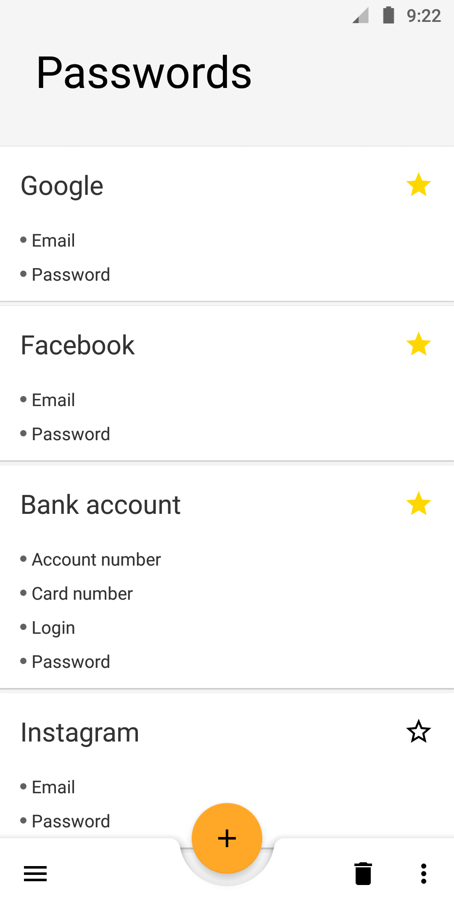
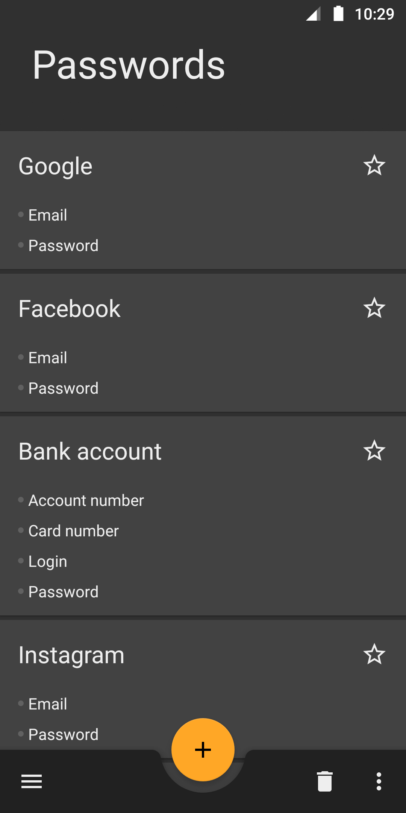
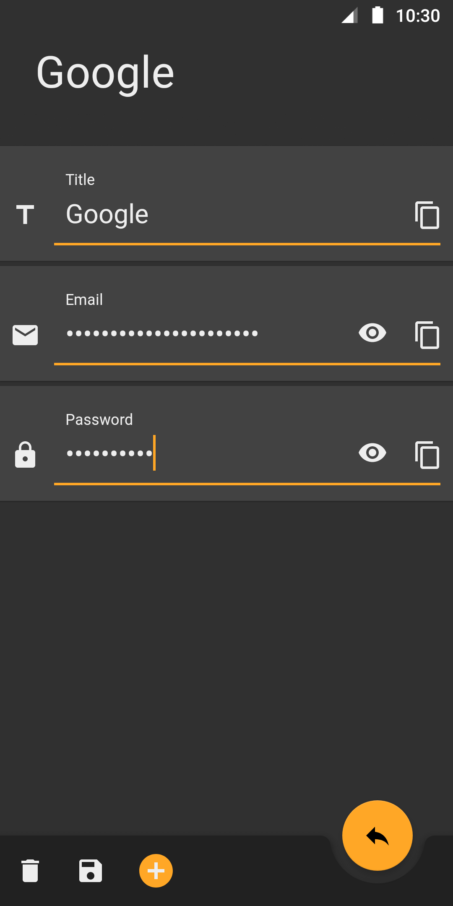
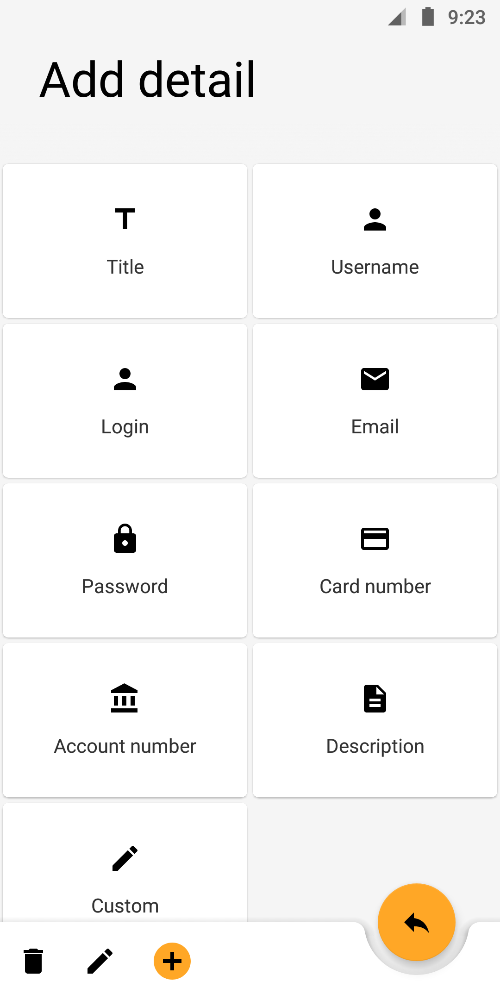

# Safely

Safely is a simple app for saving our notes or passwords.The main purpose why i wrote this app is to develop myself by testing various libraries and architectures.

The app is made with "single activity - multiple fragments" concept preferred by Google.

 
 
 
 
 

## Built With

### Language
* Kotlin - I moved the whole project from Java and RxJava2 to Kotlin with coroutines
### Architecture
* MVVM - With ViewModel and SharedViewModels class using concept.
### Design
* [Material Design](https://material.io/design/) - I am trying to keep the app up to date with top design guidelines.
### DI
* Dagger2 - With using the AndroidInjector class
### Other additionally libraries
* [EasyPrefs](https://github.com/Pixplicity/EasyPrefs) - To simple SharedPreferences class managing
* [MaterialDialog](https://github.com/afollestad/material-dialogs) - To simple create dialogs in material design guidelines
* [Navigation](https://developer.android.com/topic/libraries/architecture/navigation/) - To easy navigation between fragments

## Authors
* Patryk Kubiak

## License
This project is licensed under the Apache License, Version 2.0 - see the [LICENSE.md](https://github.com/kubiakpatryk/Safely/blob/master/LICENSE) file for details
